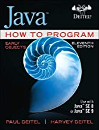
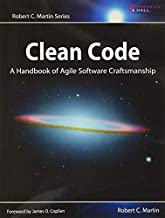

# Course Information fall 2021
Introduce students to Git and Github

## Course Description
Concepts and issues in the development of large software projects. Approaches to requirements, analysis, design, implementation, testing, and maintenance of high-quality software. Systems for software design, management, documentation and testing such as UML, GIT, Javadoc and Junit. Programming in Java. 

## Instructor
Paul Raupach

## Dates: 
Aug 18, 2021 – Dec 11, 2021

## Times: 
Tu/Th 1:15PM - 2:30PM

## Office Hours:
Tu/Th 11:00AM - 12:00 Noon, or by appointment

## Textbooks:
* 
* "The Object-Oriented Thought Process", Fifth Edition by Matt Weisfeild, Addison-Wesley,
ISBN-10: 0201760312

* "Java, How to program (early objects) Paul Deitel, Harvey Deitel, Pearson, (2017) 11th Edition ISBN: 9780134751962.

* "Clean Code: A Handbook of Agile Software Craftsmanship" , by Robert Martin, (2008) ISBN13: 978-0132350884

## Student Learning Outcomes
Students will be able to:
* Design and implement a computer-based system, process, component, or program to meet desired needs.
* Evaluate via testing a computer program to meet stated requirements.
* Employ current techniques, skills, and tools necessary for software management, development and testing.
* Perform successfully on teams to accomplish a common goal, and communicate effectively in written and oral form.

## Sal Volcano

### Computer: 
You will need a computer with a modern operating system installed and an internet
connection sufficient for connecting to zoom meetings. You will also need to have sufficient permissions on that computer to install development software and tools.
